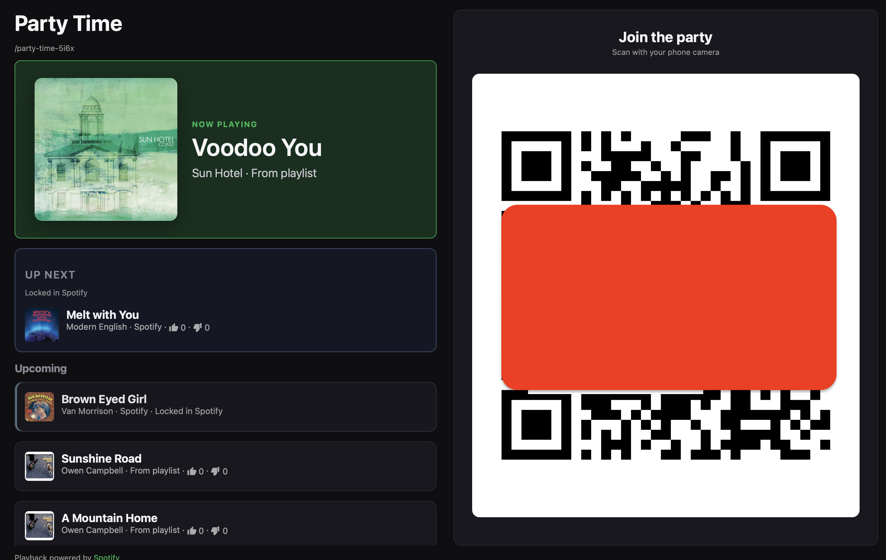
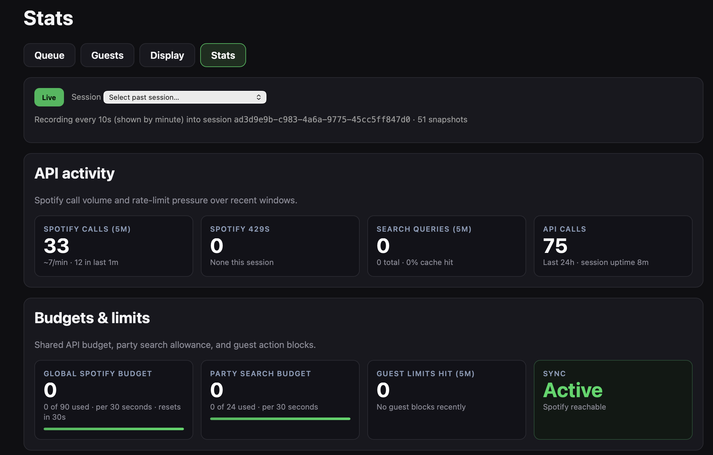
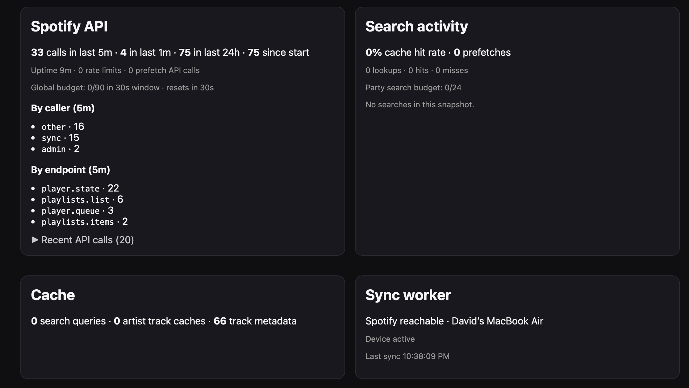
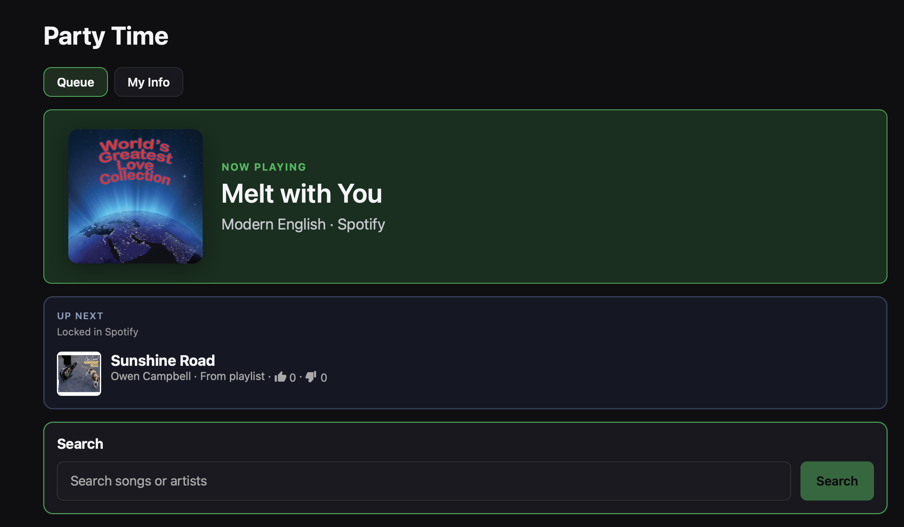
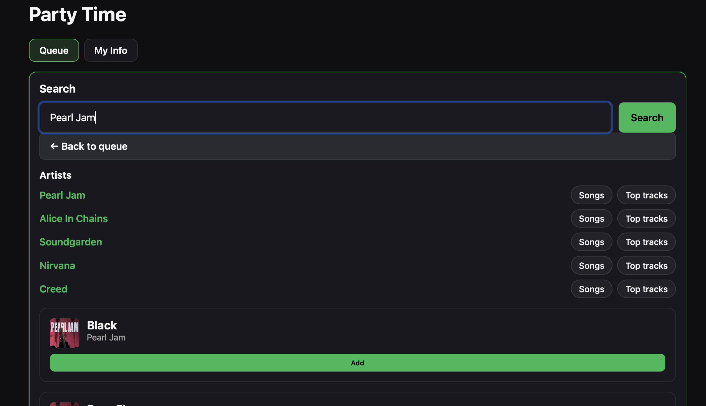
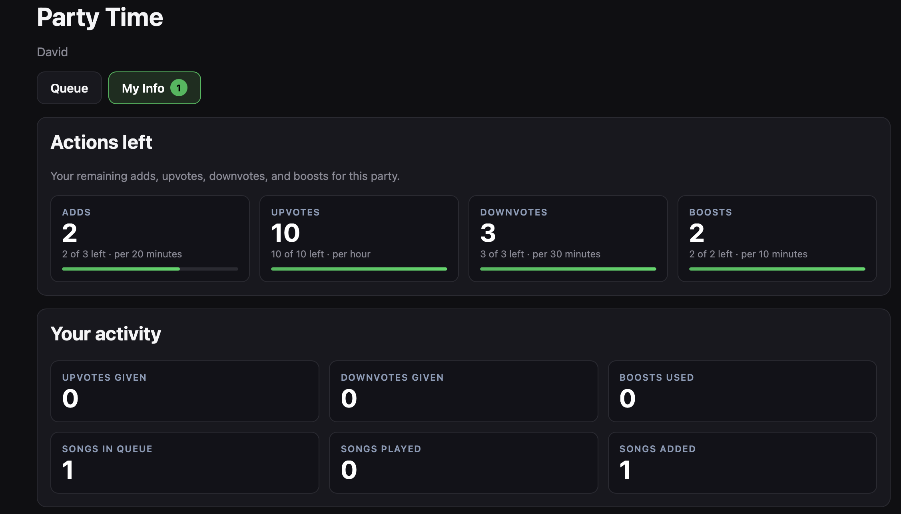
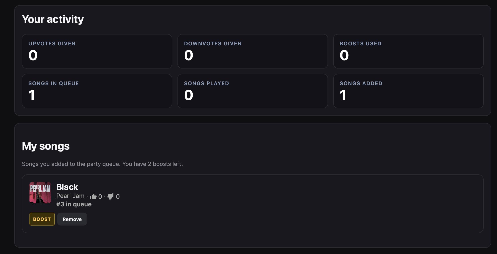

# Jukebox

[](https://github.com/currand/spotify-jukebox/actions/workflows/ci.yml)
[](LICENSE)
[](#setup)
[](https://react.dev)
[](https://www.typescriptlang.org/)
[](https://hono.dev)
[](https://developer.spotify.com/documentation/web-api)

**Self-hosted party queue for Spotify Premium** — guests vote from their phones, you control playback.

<p align="center">
  
</p>
<p align="center"><em>Display view — share the QR code on a TV while guests queue from their phones.</em></p>

<p align="center">
  
  &nbsp;
  
</p>
<p align="center"><em>Admin diagnostics — live API budget, rate-limit tracking, and sync worker health.</em></p>

<p align="center">
  
  &nbsp;
  
</p>
<p align="center">
  
  &nbsp;
  
</p>
<p align="center"><em>Guest view — search, queue, and track your own limits and songs from My Info.</em></p>

## Overview (This section written by a human)

**Self-hosted party queue for Spotify Premium.**

- Locally hosted with Docker
- Designed with Cloudflare/Tailscale in mind
- Guests join from their phones — no Spotify account required — to search for, add, upvote, downvote, and boost songs
- You stay in control of playback on your Spotify Connect device via an Admin panel
- Search caching and rate limiting keep Jukebox within Spotify's API limits and comply with their guidelines

## Goal

Spotify's Jam feature is not designed for large groups — it can rearrange or drop tracks and does not expose queue voting.

Jukebox provides a simple interface for queue management while respecting API limits. Once a party starts, only one song occupies the Spotify queue at any time. All other queue functions are managed locally.

## AI Developed

**This project is entirely written by AI. I'm not trying to hide it.** I have done my best to prompt as much structure, security, and minimalism as I can into the design but I have no history with any of the languages or tools used in this design. Your mileage may vary, buyer beware, not valid in all 50 states, subject to terms and conditions, etc.

Much of the hardening and feature building was done via github issues so I could maintain traceability. You are welcome to contribute in any way you see fit. I've provided [SPEC.md](docs/SPEC.md), [AGENTS.md](AGENTS.md) and [CONTRIBUTING.md](CONTRIBUTING.md) to help but I'm also happy to take good old fashioned human skills and contributions.

## Known Issues

- Sonos does not allow control of its queue via the Spotify app. A workaround is to use Airplay or Chromecast from your phone instead of native Sonos
- If you already have items in the play queue, they may be adopted as the next song to play. This is due to the way sync keeps the spotify queue 'canonical' to prevent getting out of sync (and allowing the admin to directly add songs to the queue, although this isn't recommended)

---


## Requirements (Below is AI generated, mostly...)


### Docker compose

Jukebox ships as a Docker Compose stack. Install [Docker Desktop](https://docs.docker.com/get-docker/) or Docker Engine with the Compose v2 plugin (`docker compose`, not the old `docker-compose`).

Pre-built images are published to [Docker Hub](https://hub.docker.com/r/currand/spotify-jukebox) as `currand/spotify-jukebox` when a GitHub Release is published. Production compose pulls `:latest` by default — run `docker compose pull` before `up` to fetch updates, or pin a version with `JUKEBOX_IMAGE=currand/spotify-jukebox:0.1.0` in project `.env`.

### Spotify Developers Account

Jukebox uses Spotify's Web API to search, queue, and control playback on **your** Premium account, so you need a small free "app" registered with Spotify.

1. Open the [Spotify Developer Dashboard](https://developer.spotify.com/dashboard) and log in with the Spotify account you'll use as host (must be **Premium**).
2. Click **Create app**, name it (e.g. `Jukebox Home`), choose **Web API** if asked.
3. Open the app and note the **Client ID**, then click **View client secret** and note the **Client secret** — both go in `.env.production` during Setup.
4. Leave the app in **Development mode** and add your own account under **User Management → Add user**. This is the normal setup for a self-hosted party app.
5. You'll add a **Redirect URI** matching your deployment once you know your `BASE_URL` — covered in each Setup section below.

**Required OAuth scopes** (requested automatically when you click Connect Spotify): `user-modify-playback-state`, `user-read-playback-state`, `playlist-read-private`, `playlist-modify-private`.

> [!IMPORTANT]
> Spotify's terms allow personal use only. Jukebox is for **private, non-commercial home parties** — not bars, gyms, or public broadcast.

---


## Setup

Pick one profile below depending on how guests will reach Jukebox. Each copies its own env file(s) and starts a different Docker Compose profile.

### Local

Simplest option — for localhost, LAN, or a reverse proxy/Tailscale you run yourself on the host.

```bash
cp .env.production.example .env.production
```

Edit `.env.production`:

```env
SPOTIFY_CLIENT_ID=...
SPOTIFY_CLIENT_SECRET=...
SPOTIFY_REDIRECT_URI=http://127.0.0.1:3000/api/v1/host/spotify/callback
BASE_URL=http://127.0.0.1:3000
ENCRYPTION_KEY=...             # openssl rand -hex 32
```

Register the same redirect URI in the Spotify app (**Settings → Redirect URIs → Add → Save**), then start:

```bash
docker compose --profile local up -d
```

Open **[http://127.0.0.1:3000/admin](http://127.0.0.1:3000/admin)**.

> [!TIP]
> **LAN Wi‑Fi party** — add `HOST_BIND=0.0.0.0` to the project `.env`, set `BASE_URL`/`SPOTIFY_REDIRECT_URI` to your LAN IP (e.g. `http://192.168.1.50:3000`), add `ALLOW_INSECURE_HTTP=1` to `.env.production`, and register that redirect URI in Spotify too.

Logs and stop:

```bash
docker compose --profile local logs -f jukebox
docker compose --profile local down
```


### Tailscale

Private access over your tailnet via MagicDNS — no host ports are published. HTTPS is provided by **Tailscale Serve** on port 443 (required for Spotify OAuth).

**Prerequisites:** Tailscale account with [MagicDNS](https://tailscale.com/kb/1081/magicdns) enabled (admin → **DNS**), and a Spotify production app.

**Quick start**

```bash
cp .env.production.example .env.production
cp .env.tailscale.example .env.tailscale
# Edit both files (see below), register the Spotify redirect URI, then:
docker compose --profile tailscale up -d
```

**1. `.env.production`** — Spotify credentials and secrets only. You do **not** need `BASE_URL` or `SPOTIFY_REDIRECT_URI` for this profile (the app builds them from `.env.tailscale`).

```env
SPOTIFY_CLIENT_ID=...
SPOTIFY_CLIENT_SECRET=...
ENCRYPTION_KEY=...   # openssl rand -hex 32
```

**2. `.env.tailscale`**

| Variable | Where to find it |
| --- | --- |
| `TS_AUTHKEY` | Tailscale admin → **Settings → Keys** → Generate auth key (reusable recommended) |
| `TS_HOSTNAME` | MagicDNS machine name you choose (default `jukebox`) |
| `TAILNET_DNS_NAME` | Tailscale admin → **DNS** → **Tailnet DNS name** (e.g. `yak-bebop.ts.net`) |

Your app URL: `https://<TS_HOSTNAME>.<TAILNET_DNS_NAME>` (example: `https://jukebox.yak-bebop.ts.net`).

**3. Spotify redirect URI** — Developer Dashboard → your app → **Settings → Redirect URIs**, add exactly:

```text
https://<TS_HOSTNAME>.<TAILNET_DNS_NAME>/api/v1/host/spotify/callback
```

**4. Start and verify**

```bash
docker compose --profile tailscale up -d
docker compose --profile tailscale logs -f tailscale    # wait for connected + Serve
curl -I https://jukebox.yak-bebop.ts.net                # from a tailnet device; use your URL
```

Open `https://<TS_HOSTNAME>.<TAILNET_DNS_NAME>/admin` → **Connect Spotify**.

> **First boot:** Tailscale provisions a TLS cert for MagicDNS; allow ~30–60s after the sidecar connects before HTTPS works.

**Stop**

```bash
docker compose --profile tailscale down
```


### Cloudflare Tunnel

Public HTTPS without opening any port — no host ports are published.

```bash
cp .env.production.example .env.production
cp .env.cloudflared.example .env.cloudflared
```

- `.env.production`: Spotify credentials, `BASE_URL` = `https://your-tunnel-hostname`
- `.env.cloudflared`: `TUNNEL_TOKEN` from Cloudflare Zero Trust → **Networks → Tunnels**

Point the tunnel at `http://jukebox:3000` and register the **https://** hostname as your Spotify redirect URI, then:

```bash
docker compose --profile cloudflare up -d
```

Logs and stop:

```bash
docker compose --profile cloudflare logs -f cloudflared
docker compose --profile cloudflare down
```


### Advanced .env configuration

> [!WARNING]
> Never commit `.env.production`, `.env.cloudflared`, or `.env.tailscale` — they hold live secrets. Only the `*.example` templates should be committed.


| File               | Purpose                                                                   |
| ------------------ | ------------------------------------------------------------------------- |
| `.env.production`  | Spotify credentials, secrets, `BASE_URL` — used by `local` and `cloudflare` profiles |
| `.env.cloudflared` | `TUNNEL_TOKEN` — `cloudflare` profile only                                |
| `.env.tailscale`   | `TS_AUTHKEY`, `TS_HOSTNAME`, `TAILNET_DNS_NAME` — `tailscale` profile only |
| `.env`             | Optional Compose overrides (`HOST_BIND`, `JUKEBOX_PORT`, `JUKEBOX_IMAGE`) |


Key variables in `.env.production` (for **local** and **cloudflare** profiles; the **tailscale** profile derives `BASE_URL` / `SPOTIFY_REDIRECT_URI` from `.env.tailscale` instead):


| Variable                                      | Required | Notes                                                                                             |
| --------------------------------------------- | -------- | ------------------------------------------------------------------------------------------------- |
| `SPOTIFY_CLIENT_ID` / `SPOTIFY_CLIENT_SECRET` | yes      | From the Spotify Developer Dashboard; never commit the secret                                     |
| `SPOTIFY_REDIRECT_URI`                        | local/cloudflare | Must match the Spotify app and `BASE_URL` hostname exactly                              |
| `BASE_URL`                                    | local/cloudflare | URL guests and admin use in the browser                                               |
| `ENCRYPTION_KEY`                              | yes      | `openssl rand -hex 32`; encrypts Spotify tokens at rest                                           |
| `HOST_SETUP_TOKEN`                            | no       | When set, required before Connect Spotify (`openssl rand -hex 16`); remove the line to disable    |
| `ALLOW_INSECURE_HTTP`                         | no       | Set `1` for `http://` LAN deployments (local profile)                                             |
| `HOST_BIND` / `JUKEBOX_PORT`                  | no       | Project `.env`; `local` profile bind address (default `127.0.0.1`) and host port (default `3000`) |


Advanced tuning knobs (`SPOTIFY_API_BUDGET_*`, `SYNC_*`, `DEBUG`, etc.) are commented out in `.env.production.example` with their defaults — see that file and [docs/SECURITY.md](docs/SECURITY.md) if you need to change them.

---


## First run


### Logging in to Spotify

Open `/admin`. If `HOST_SETUP_TOKEN` is set, paste it into **Host setup token** first. Click **Connect Spotify** and approve the requested scopes — you're redirected back to admin, connected.

### Create a party

Enter a **party name** (it must not match an existing Spotify playlist name on your account — Jukebox creates a private playlist with that exact name when you go live) and pick a **seed playlist** from your Spotify account to import. Expand **Advanced guest limits** to tune rate limits before creating, or leave the defaults. If you have a previous (archived) party, you can resume it instead, or import its track list as the seed for a new one.

### Starting the queue

In the party card, pick a **target player** from your Spotify Connect devices (**Refresh devices** if the list is empty — open Spotify on that speaker/computer first), then click **Turn ON**. Jukebox builds a short bootstrap playlist on that device and starts playback; the sync worker takes over from there. Share the **QR code** or **join link** shown on the party card so guests can join.

### Queue management functions

From the admin queue page:

- **Turn ON / Turn OFF** — freezes guest mutations when off; **Sync with Spotify** forces an immediate sync tick
- **Shuffle** — randomizes the upcoming normal queue (leaves the boost lane and now-playing untouched)
- **Clear upcoming** — removes everything upcoming, keeps now-playing
- **Play / Pause / Skip** — controls playback on the party's target device directly from admin
- **Search and add** — host search bar adds tracks with no rate limit, attributed to "Host"
- Per-track controls: **force next**, **move up / move down**, **remove**, **reset votes**, and **Start from here** (drops every upcoming track that would play before the selected one)
- **History** panel shows played/skipped/downvoted tracks, with **Unblock** to let a downvoted or played track be re-added


### Full screen

Click **Open display view** on the party card (`/admin/display?fullscreen=1`) for a TV-friendly screen — QR code, now playing, and the upcoming queue, auto-entering fullscreen. Good for a shared screen at the party.

### User management

The **Guests** tab (`/admin/guests`) lists every guest: display name, last seen, join date, IP, songs added, and upvote/downvote/boost counts. From here you can **Reset limits** for one guest, **Ban/Unban** them, or **Clear all guests** to wipe sessions between parties (their added songs stay in the queue).

### Admin Statistics

The **Stats** tab (`/admin/diagnostics`) shows live Spotify API call volume against your budget, search cache hit rate, and sync worker/device health. Switch to a past **session** to review recorded snapshots (captured every 10 seconds, summarized by minute, with 429s flagged) — useful after a party to see what triggered any rate limiting.

---


## Guest features


### Guest Name selection

Guests join via the QR code or link and pick a display name before they can search, vote, or boost.

#### Name collision and reclaiming a session

If the name exactly matches an existing guest, Jukebox asks **"Is that you?"** — choosing **Yes** reclaims that guest's session (their votes and boost usage carry over), or **No** lets you pick a different name. A close/typo-level match prompts the same reclaim choice, but choosing **"No, that's not me"** keeps your distinct name after confirming, instead of forcing a rename.

### Guest functions


#### Search

Search Spotify tracks and artists from the queue page. Tapping an artist lets you filter to their **Songs** or **Top tracks**. Adding a track is blocked with a clear reason if it's already active in the queue or matches something recently played or downvoted.

#### Voting

**Upvote** a song once (not your own) to move it up the normal queue by vote count. **Downvote** a song once — including your own, with a confirmation warning — to push it toward removal; downvoting is disabled on the currently playing track. Once a song reaches the party's downvote threshold, it's removed from the queue.

#### Boosting

Each guest gets a small, refillable **boost budget** (a rate-limit window, 2 per 10 minutes by default) to jump a song into the priority **boost lane**, ahead of the normal queue. An optional party-wide **boost cap** limits how many tracks can be boosted at once. Boosts can be undone from **My Info** to free up the slot.

---


## Advanced Admin configuration


### Guest parameters

Under **Guest limits** on the party card (or **Advanced guest limits** when creating a party), configure:


| Setting                  | Default           |
| ------------------------ | ----------------- |
| Downvotes to skip a song | 5                 |
| Active boost cap         | 8                 |
| Add a song               | 3 per 20 minutes  |
| Upvote                   | 10 per 60 minutes |
| Downvote                 | 3 per 30 minutes  |
| Boost                    | 2 per 10 minutes  |
| Search (per guest)       | 5 per 60 seconds  |
| Search (whole party)     | 24 per 30 seconds |


**Save limits** applies changes to the current party only; **Save as defaults** applies them to every party you create afterward. Reset a single guest's usage from the **Guests** page instead of changing party-wide limits.

---


## More

- [docs/SPEC.md](docs/SPEC.md) — full behavior spec, queue rules, rate limits, API surface
- [docs/SECURITY.md](docs/SECURITY.md) — pre-publish checklist, secret handling, hardening notes (Jukebox is built for a **private party**, not a public multi-tenant service)
- [CONTRIBUTING.md](CONTRIBUTING.md) — local dev setup, tests, mock stack, endurance testing

---


## Environment variable reference

Every variable read by Jukebox, grouped by the file it belongs in. `*.example` files in the repo root are templates — copy them (see [Setup](#setup)) and never commit the copies.

### Project `.env` (optional, Compose interpolation only)

| Variable          | Description                                                  | Default        |
| ------------------ | -------------------------------------------------------------- | ---------------- |
| `HOST_BIND`       | Host bind address for the `local` profile's published port (`0.0.0.0` for LAN) | `127.0.0.1`    |
| `JUKEBOX_PORT`    | Host port published by the `local` profile                     | `3000`         |
| `JUKEBOX_IMAGE`   | Docker image to run (all production profiles) | `currand/spotify-jukebox:latest` |
| `JUKEBOX_PLATFORM`| Build platform for registry publish scripts                    | *(host arch)*  |

### `.env.production`

App config used by the server for every Docker profile below. For local development (`.env.development`), see [CONTRIBUTING.md](CONTRIBUTING.md).

| Variable                    | Description                                                                                  | Default                                              |
| ---------------------------- | ----------------------------------------------------------------------------------------------- | ------------------------------------------------------- |
| `SPOTIFY_CLIENT_ID`         | Spotify app Client ID from the Developer Dashboard                                          | *(required; `mock-client` in `SPOTIFY_MODE=mock`)*   |
| `SPOTIFY_CLIENT_SECRET`     | Spotify app Client Secret — never commit                                                     | *(required; `mock-secret` in `SPOTIFY_MODE=mock`)*   |
| `SPOTIFY_REDIRECT_URI`      | OAuth callback URL; must match the Spotify app exactly                                       | *(required; omitted for `tailscale` profile — derived from `.env.tailscale`)* |
| `BASE_URL`                  | Public URL guests/admin use in the browser; sets secure-cookie policy                        | *(required; omitted for `tailscale` profile — derived from `.env.tailscale`)* |
| `ENCRYPTION_KEY`            | Encrypts stored Spotify tokens at rest — generate with `openssl rand -hex 32`                | *(required)* |
| `HOST_SETUP_TOKEN`          | When set, required in Admin before **Connect Spotify**; unset disables the check             | *(unset — disabled)*                                 |
| `ALLOW_INSECURE_HTTP`       | Set `1` to allow `http://` for `BASE_URL`/`SPOTIFY_REDIRECT_URI` in production (LAN parties) | `0` (unset)                                           |
| `DATABASE_PATH`             | SQLite file path (set by Compose in Docker)                                                  | `/data/jukebox.db` |
| `PORT`                      | Port the API server listens on inside the container                                          | `3000`                                                |
| `BIND_HOST`                 | Server bind address inside the container; Compose sets `0.0.0.0` for Docker profiles         | `0.0.0.0` |
| `NODE_ENV` / `JUKEBOX_ENV`  | Set to `production` by Compose for deployment profiles                                       | `production`                                         |
| `SPOTIFY_MODE`              | `live` (real Spotify API) — mock mode is for development only                                | `live`                                                |
| `SPOTIFY_API_BASE_URL`      | Spotify Web API base URL — override to point at the mock service                             | `https://api.spotify.com/v1`                          |
| `SPOTIFY_ACCOUNTS_BASE_URL` | Spotify Accounts (OAuth) base URL — override to point at the mock service                    | `https://accounts.spotify.com`                        |
| `SPOTIFY_API_BUDGET_COUNT`  | Max Spotify API calls allowed per budget window                                              | `90`                                                  |
| `SPOTIFY_API_BUDGET_WINDOW_MS` | Length of the API budget window, in ms                                                    | `30000`                                               |
| `SPOTIFY_DAILY_WARN_CALLS`  | Diagnostics warns when 24h Spotify API calls exceed this                                     | `8000`                                                |
| `SYNC_FAST_POLL`            | `1` polls Spotify every 10s (legacy); unset uses adaptive polling                             | `0` (adaptive)                                        |
| `SYNC_END_WINDOW_MS`        | Adaptive sync: how far before estimated track end to poll, in ms                              | `7000`                                                |
| `SYNC_FALLBACK_INTERVAL_MS` | Adaptive sync: poll interval when playing but track timing is unknown, in ms                   | `30000`                                               |
| `SYNC_IDLE_INTERVAL_MS`     | Adaptive sync: poll interval when idle/paused with no pending work, in ms                      | `60000`                                               |
| `DEBUG`                     | Comma-separated debug namespaces to log (e.g. `spotify,sync`), or `1`/`*` for all             | *(unset — off)*                                       |

Development-only variables (`JUKEBOX_SERVE_CLIENT`, mock Spotify URLs, etc.) are documented in [CONTRIBUTING.md](CONTRIBUTING.md).

### `.env.cloudflared`

| Variable       | Description                                                                | Default        |
| -------------- | ----------------------------------------------------------------------------- | ---------------- |
| `TUNNEL_TOKEN` | Cloudflare Tunnel connector token (Zero Trust → Networks → Tunnels)          | *(required for the `cloudflare` profile)* |

### `.env.tailscale`

| Variable           | Description                                                                 | Default        |
| ------------------ | --------------------------------------------------------------------------- | ---------------- |
| `TS_AUTHKEY`       | Tailscale auth key (admin → Settings → Keys)                                | *(required)*     |
| `TS_HOSTNAME`      | MagicDNS machine name; app URL is `https://<TS_HOSTNAME>.<TAILNET_DNS_NAME>` | `jukebox`        |
| `TAILNET_DNS_NAME` | Tailnet DNS suffix from admin → DNS (e.g. `yak-bebop.ts.net`)               | *(required)*     |

The app derives `BASE_URL` and `SPOTIFY_REDIRECT_URI` from `TS_HOSTNAME` + `TAILNET_DNS_NAME` when those are set. Start with `docker compose --profile tailscale up -d`.

