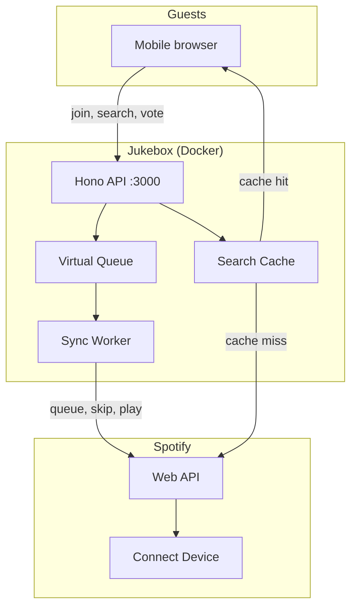

# Jukebox

## Overview (This section written by a human)
**Self-hosted party queue for Spotify Premium.**
- Locally hosted with Docker
- Designed with Cloudflare/Tailscale in mind
- Guests join from their phones — no Spotify account required — to search for, add, upvote, veto, and boost songs
- You stay in control of playback on your Spotify Connect device via an Admin panel
- Search caching and rate limiting keep Jukebox within Spotify's API limits and comply with their guidelines

## Goal
Spotify's Jam feature is not designed for large groups — it can rearrange or drop tracks and does not expose queue voting.

Jukebox provides a simple interface for queue management while respecting API limits. Once a party starts, only one song occupies the Spotify queue at any time. All other queue functions are managed locally.

## AI Developed
**This project is entirely written by AI. I'm not trying to hide it.** I have done my best to prompt as much structure, security, and minimalism as I can into the design but I have no history with any of the languages or tools used in this design. Your mileage may vary, buyer beware, not valid in all 50 states, subject to terms and conditions, etc.

Much of the hardening and feature building was done via github issues so I could maintain traceability. You are welcome to contribute in any way you see fit. I've provided [SPEC.md](docs/SPEC.md), [AGENTS.md](AGENTS.md) and [CONTRIBUTING.md](CONTRIBUTING.md) to help but I'm also happy to take good old fashioned human skills and contributions.

---

## Architecture



Jukebox maintains a **virtual queue** with voting and veto logic. Spotify's API cannot reorder or remove queued tracks, so Jukebox syncs intelligently — adding the next track, skipping when needed, and keeping guest-facing order separate from what Spotify's player shows.

### For guests

- Join via QR code or link — pick a display name and go
- Search Spotify and add tracks to the party queue
- Upvote songs they want sooner
- Veto songs; when enough guests agree, the track is removed
- **Boost** a song to jump it toward the front of the queue

### For you (the host)

- Admin page at `/admin` — connect Spotify once, create a party, show a QR code
- Import a seed playlist when the party starts
- Turn the party on/off, set veto threshold and guest limits
- Full queue control: shuffle, reorder, skip, force-next, ban guests
- Start / stop / skip playback on your active Spotify device from the admin UI
- Full-screen display that shows the QR and queue
- Resume a previous party or use it as a seed for a new one

### Under the hood

- One party active at a time
- SQLite stores the queue on a Docker volume so restarts do not wipe your party

---

## What you need

| | |
|---|---|
| **Docker** | [Docker Desktop](https://docs.docker.com/get-docker/) or Docker Engine with Compose v2 (`docker compose`) |
| **Spotify Premium** | Host account only — guests do not need Spotify |
| **Spotify Developer app** | Free; one app for your production deployment (see below) |
| **A URL guests can reach** | Public HTTPS (reverse proxy or [Cloudflare Tunnel](#cloudflare-tunnel)), or a LAN address for a Wi‑Fi-only party |

---

## Spotify Developer account and app

Jukebox uses Spotify's Web API to search, queue, and control playback on **your** Premium account. You register a small "app" in Spotify's developer portal so Jukebox can authenticate.

### 1. Create a developer account

1. Open the [Spotify Developer Dashboard](https://developer.spotify.com/dashboard).
2. Log in with the **same Spotify account** you use as the party host (must be **Premium**).
3. Accept the terms if prompted.

### 2. Create an app

1. Click **Create app**.
2. Name it something like `Jukebox Home` and add a short description.
3. Choose **Web API** if asked.
4. After creation, open the app and note the **Client ID**.
5. Click **View client secret** and copy the **Client secret** — you will put both in `.env.production`.

### 3. Set the redirect URI

Spotify sends the host back to Jukebox after login. The redirect URI must match **exactly** (scheme, hostname, path — no trailing slash quirks).

| How you expose Jukebox | Redirect URI to add in the Spotify app |
|---|---|
| Public HTTPS (proxy or tunnel) | `https://your-hostname.example.com/api/v1/host/spotify/callback` |
| LAN only (`http://192.168.x.x:3000`) | `http://192.168.x.x:3000/api/v1/host/spotify/callback` |
| Tailscale (`http://127.0.0.1:3000`) | `http://127.0.0.1:3000/api/v1/host/spotify/callback` |

In the Spotify app: **Settings → Redirect URIs → Add** the URI, then **Save**.

The same value goes in `.env.production` as `SPOTIFY_REDIRECT_URI`. Its hostname must match `BASE_URL`.

### 4. Keep the app in Development mode

For personal home use, leave the app in **Development mode** and add your Spotify account under **User Management → Add user**. That is the normal setup for a self-hosted party app — you are not publishing a public Spotify integration.

**Required OAuth scopes** (requested automatically when you click Connect Spotify): `user-modify-playback-state`, `user-read-playback-state`, `playlist-read-private`.

### 5. Policy reminder

Spotify's terms allow personal use. Jukebox is for **private, non-commercial home parties** — not bars, gyms, or public broadcast. Do not use it to synchronize playback for a paying audience.

---

## Spotify API limits and how Jukebox stays under them

Spotify rate-limits Web API calls. Exact limits are not fully documented, but heavy use (many guests searching at once, aggressive polling) can trigger **429 Too Many Requests**. Jukebox is designed for a typical house party, not a stadium.

Spotify rate limits can last up to **24 hours**. Search traffic is the primary driver of 429 errors, so keep per-guest search limits conservative.

### What Jukebox limits automatically

**Guest quotas** (defaults; adjustable per party in admin):

| Action | Default limit | Window |
|---|---|---|
| Add a song | 3 | 20 minutes |
| Upvote | 10 | 60 minutes |
| Veto | 3 | 30 minutes |
| Boost | 1 | 10 minutes |
| Search (per guest) | 6 | 60 seconds |
| Search (whole party) | 24 | 30 seconds |

Guests see clear messages when they hit a limit (e.g., "You've added your limit of 3 songs — wait 20 minutes and try again").

**Outbound API budget** — Jukebox caps total Spotify API calls at **90 per 30 seconds** by default (`SPOTIFY_API_BUDGET_*` in `.env.production`). Sync, search, and queue operations share this budget so one busy party does not hammer Spotify in bursts.

**Smarter API use**

- **Search caching** — repeat queries hit cache instead of Spotify
- **Adaptive sync** — polls playback shortly before a track ends instead of polling constantly
- **429 backoff** — when Spotify says slow down, Jukebox honors `Retry-After` and pauses outbound calls
- **Daily call tracking** — admin diagnostics warn if you approach ~8,000 calls in 24 hours (`SPOTIFY_DAILY_WARN_CALLS`)

### Practical guidance

- **~50 guests** browsing and **~15 actively** searching/adding is the design target.
- Spectators who only watch the queue do not consume search budget.
- If many guests search different obscure artists at once, some searches may wait briefly — that is intentional throttling.
- For a multi-hour party, keep guest limits at defaults unless you have a small, well-behaved group.
- If admin diagnostics show sustained 429s, end the party, wait a few minutes, and avoid restarting with everyone searching at once.

Tune advanced knobs in `.env.production` — see [CONTRIBUTING.md](CONTRIBUTING.md) and `.env.production.example`.

---

## Deploy Jukebox

### Choose a deployment mode

| Mode | When to use | Env files |
|---|---|---|
| **Production** | Reverse proxy, LAN IP, or direct port publish | `.env.production` |
| **Production + Cloudflare Tunnel** | Public HTTPS without opening a firewall port | `.env.production`, `.env.cloudflared` |

After starting, open **`{BASE_URL}/admin`**, connect Spotify, create a party, and share the QR code.

---

## Production setup

Docker serves the app on port **3000** by default.

### 1. Configure environment

```bash
cp .env.production.example .env.production
```

Edit `.env.production`:

```env
SPOTIFY_CLIENT_ID=...          # from Spotify Developer Dashboard
SPOTIFY_CLIENT_SECRET=...
SPOTIFY_REDIRECT_URI=https://jukebox.example.com/api/v1/host/spotify/callback
BASE_URL=https://jukebox.example.com
ENCRYPTION_KEY=...             # openssl rand -hex 32
HOST_SETUP_TOKEN=...           # openssl rand -hex 16 — when required (see below)
```

Generate secrets:

```bash
openssl rand -hex 32   # ENCRYPTION_KEY (≥ 32 characters)
openssl rand -hex 16   # HOST_SETUP_TOKEN — when required
```

**`HOST_SETUP_TOKEN`** protects admin Spotify login on public deployments. It is **required** when Jukebox listens on all interfaces (default). It is **not required** when:

- Binding localhost only: `BIND_HOST=127.0.0.1` and/or `BASE_URL=http://127.0.0.1:3000`
- Using [Cloudflare Tunnel](#cloudflare-tunnel) (`CLOUDFLARE_TUNNEL=1` is set automatically)
- You explicitly set `DISABLE_HOST_SETUP_TOKEN=1`

For a **machine-local** deployment (only you on that computer), set `BIND_HOST=127.0.0.1`, `BASE_URL=http://127.0.0.1:3000`, and map `"127.0.0.1:3000:3000"` in `docker-compose.yml` — no setup token needed.

Use **https://** for public URLs. For http:// on a trusted home Wi‑Fi, set `ALLOW_INSECURE_HTTP=1` and use your LAN IP in `BASE_URL` and the Spotify redirect URI.

### 2. Start

```bash
docker compose --profile default up --build -d
```

Open **`{BASE_URL}/admin`**, enter **Host setup token** if prompted, then **Connect Spotify**.

### 3. Logs and stop

```bash
docker compose --profile default logs -f jukebox
docker compose --profile default down
```

---

## Cloudflare Tunnel

Get public HTTPS without opening port 3000 on your router. The tunnel overlay sets `CLOUDFLARE_TUNNEL=1`, so **`HOST_SETUP_TOKEN` is not required** — use Cloudflare Access or turn the tunnel off when you are not hosting for extra protection.

```bash
cp .env.production.example .env.production
cp .env.cloudflared.example .env.cloudflared
# Edit .env.production (Spotify credentials, BASE_URL = your tunnel hostname)
# Add TUNNEL_TOKEN from Cloudflare Zero Trust → Networks → Tunnels

docker compose --profile default --profile tunnel \
  -f docker-compose.yml -f docker-compose.tunnel.yml up --build -d
```

In Cloudflare, point the tunnel public hostname to `http://jukebox:3000`. Register that **https://** hostname as your Spotify redirect URI **before** connecting Spotify.

```bash
docker compose --profile default --profile tunnel \
  -f docker-compose.yml -f docker-compose.tunnel.yml logs -f cloudflared

docker compose --profile default --profile tunnel \
  -f docker-compose.yml -f docker-compose.tunnel.yml down
```

---

## Running a party

1. **Before guests arrive** — Open `/admin`, connect Spotify, create a party (name + seed playlist), configure veto threshold and guest limits if you want stricter rules than defaults.
2. **Start playback** — Open Spotify on your speaker, TV, or phone (Spotify Connect). Jukebox controls whichever device is currently active.
3. **Share the party** — Show the QR code or copy the guest link. Guests set a display name, then search and interact.
4. **During the party** — Toggle the party **on** to allow guest actions; **off** to freeze the queue. Use admin controls to skip, shuffle, or recover from a bad streak of adds.
5. **Afterward** — Turn the party off. Stop the tunnel or container when you are done if it was publicly reachable.

If no Spotify device is active, guests can still add and vote — you will see a warning in admin until you start playback somewhere.

---

## Environment files

| File | Purpose |
|---|---|
| `.env.production` | Spotify credentials, secrets, `BASE_URL` — used by the `jukebox` container |
| `.env.cloudflared` | `TUNNEL_TOKEN` only — used when running the tunnel profile |
| `.env` | Optional Compose overrides (`JUKEBOX_IMAGE`, `JUKEBOX_PORT`) |

Copy from `.env.production.example`, `.env.cloudflared.example`, and `.env.example`.

### Key variables

| Variable | Required | Notes |
|---|---|---|
| `SPOTIFY_CLIENT_ID` | yes | From Spotify Developer Dashboard |
| `SPOTIFY_CLIENT_SECRET` | yes | Keep secret; never commit |
| `SPOTIFY_REDIRECT_URI` | yes | Must match Spotify app and `BASE_URL` hostname |
| `BASE_URL` | yes | URL guests and admin use in the browser |
| `ENCRYPTION_KEY` | yes | `openssl rand -hex 32`; encrypts Spotify tokens in the database |
| `HOST_SETUP_TOKEN` | usually | Not needed for localhost-only or Cloudflare Tunnel |
| `ALLOW_INSECURE_HTTP` | no | Set `1` for http:// LAN deployments |
| `BIND_HOST` | no | `127.0.0.1` for localhost-only |
| `TUNNEL_TOKEN` | tunnel only | In `.env.cloudflared`, not `.env.production` |

Full reference: `.env.production.example`, [docs/SECURITY.md](docs/SECURITY.md).

---

## Security

Jukebox is meant for a **private party**, not a public multi-tenant service. See [docs/SECURITY.md](docs/SECURITY.md) for the pre-publish checklist, secret handling, and hardening notes.

---

## Contributing

Want to develop locally, run tests, or build custom images? See [CONTRIBUTING.md](CONTRIBUTING.md).

---

## License

MIT — see [LICENSE](LICENSE).
